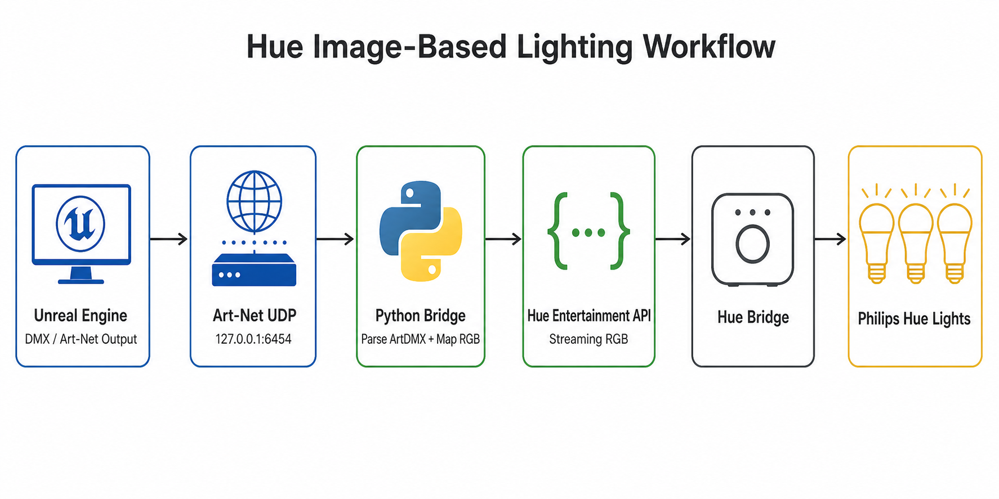

# Communication Workflow

This project connects Unreal Engine DMX output to Philips Hue Entertainment streaming through a small Python Art-Net receiver.

Important distinction: the Hue Bridge does **not** receive DMX or Art-Net directly. DMX/Art-Net exists only between Unreal Engine and the Python bridge. The Python bridge then sends Hue Entertainment API messages to the Hue Bridge.



## Data Path

1. Unreal Engine and the Python bridge run on the same local computer.
2. Unreal Engine sends DMX frames using its Art-Net output to `127.0.0.1:6454`.
3. Art-Net is the protocol on the local UDP link between Unreal Engine and Python, not a separate hardware device or app.
4. The Python bridge listens for ArtDMX UDP packets on port `6454`.
5. The bridge filters packets by universe.
6. DMX channels are mapped into Hue RGB values.
7. RGB updates are sent through the Hue Entertainment Streaming API over the LAN.
8. The Hue Bridge receives Hue Entertainment stream data, not DMX.
9. The Hue Bridge forwards the real-time lighting state to Hue lights.

## Why `127.0.0.1`

Use `127.0.0.1` as the Unreal Art-Net destination when Unreal Engine and the Python bridge are running on the same computer. Use the receiver machine's LAN IP only when Unreal and the Python bridge run on different machines.

The Hue Bridge IP is configured separately in `bridge/config.json` as `hue.ip_address`. Do not hardcode a personal bridge IP in public docs.

## Related Workflow Views

- [Hardware Workflow](hardware-workflow.md)
- [System Architecture](system-architecture.md)

## Public Overview Image

The rendered communication workflow image lives at:

```text
docs/images/communication-workflow.png
```
