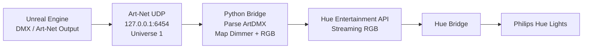

# Communication Workflow

This project connects Unreal Engine DMX output to Philips Hue Entertainment streaming through a small Python Art-Net receiver.



## Data Path

1. Unreal Engine sends DMX frames using Art-Net.
2. The Python bridge listens for ArtDMX UDP packets on port `6454`.
3. The bridge filters packets by universe.
4. DMX channels are mapped into Hue RGB values.
5. RGB updates are sent through the Hue Entertainment Streaming API.
6. The Hue Bridge forwards the real-time lighting state to Hue lights.

## Why `127.0.0.1`

Use `127.0.0.1` as the Unreal Art-Net destination when Unreal Engine and the Python bridge are running on the same computer. Use the receiver machine's LAN IP only when Unreal and the Python bridge run on different machines.

## Public Overview Image

The rendered overview image lives at:

```text
docs/images/communication-workflow.png
```
