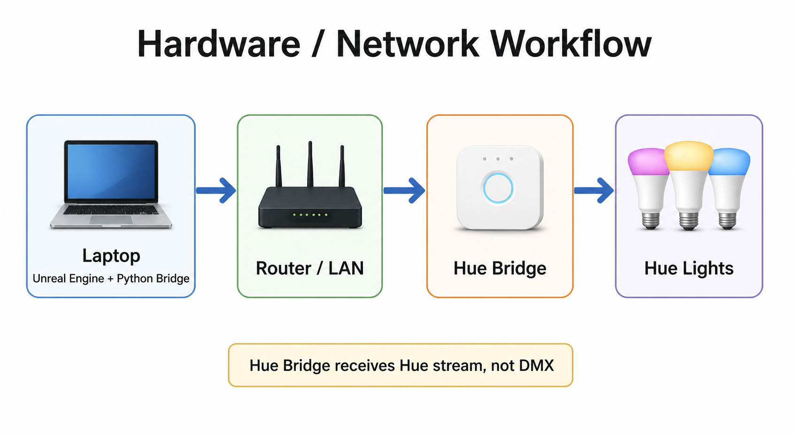

# Hardware Workflow

This view shows the physical devices involved in the setup.



The generated image is intended for quick reading. The Mermaid diagram below is the editable source-of-truth version.


## Physical Connection

```text
Laptop -> Router / LAN -> Hue Bridge -> Hue Lights
```

The laptop runs both Unreal Engine and the Python bridge. Unreal Engine does not talk directly to the Hue Bridge. The Python bridge is the translator between Unreal DMX output and the Hue Entertainment API.

## What Runs Where

| Device | Runs / Handles |
| --- | --- |
| Laptop | Unreal Engine, DMX output, Python bridge |
| Router / LAN | Network transport between laptop and Hue Bridge |
| Hue Bridge | Hue Entertainment stream receiver and Hue light controller |
| Hue Lights | Final lighting output |

## Key Point

The Hue Bridge does not receive DMX or Art-Net directly. It receives Hue Entertainment API stream data from the Python bridge.
