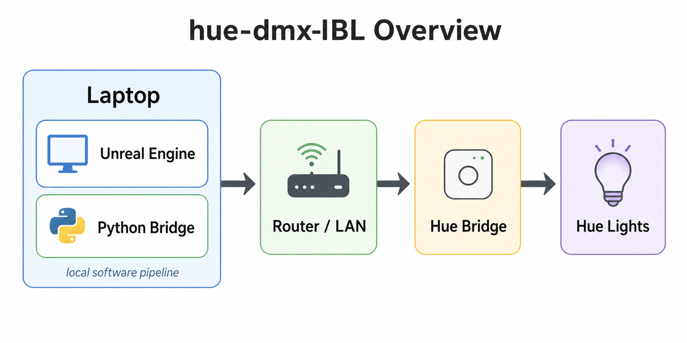

# Overview

`hue-dmx-IBL` documents an image-based lighting workflow where Unreal Engine drives Philips Hue fixtures through DMX over Art-Net.

The key design decision is to keep Unreal Engine responsible for lighting content and DMX output, while the Python bridge handles protocol translation from Art-Net packets to Hue Entertainment streaming calls.

The Hue Bridge is not a DMX receiver. It receives Hue Entertainment API stream data from the Python bridge, then controls the Hue lights.

## Workflow Views

| View | What it answers |
| --- | --- |
| [Hardware Workflow](hardware-workflow.md) | What physical devices are connected? |
| [Communication Workflow](communication-workflow.md) | Which protocol is used at each step? |
| [System Architecture](system-architecture.md) | What does each software/hardware component do? |

## Components

| Component | Responsibility |
| --- | --- |
| Unreal Engine | Generates DMX / Art-Net output |
| Art-Net UDP | Transports DMX frames locally from Unreal Engine to Python |
| Python Bridge | Receives ArtDMX packets and maps DMX channels to RGB |
| Hue Entertainment API | Streams low-latency color updates |
| Hue Bridge | Relays updates to Hue lights |
| Hue Lights | Display the final RGB lighting state |

See [communication-workflow.md](communication-workflow.md) for the full signal path.
